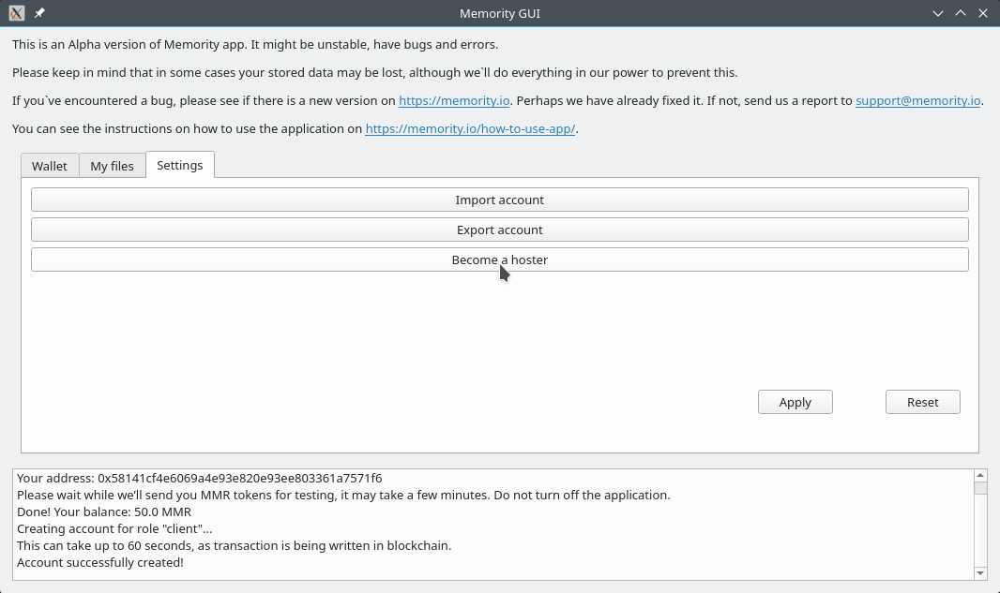
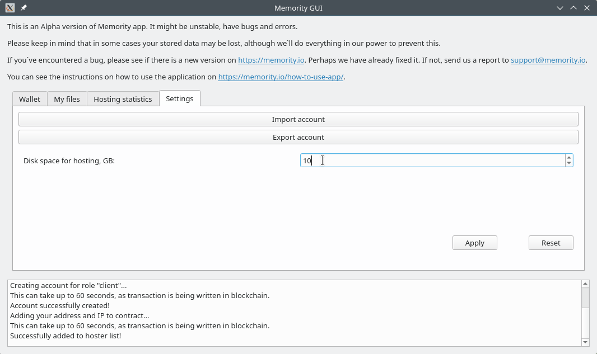
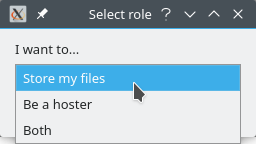

# Как сдать часть памяти своего компьютера для хранения данных в систему Memority

\* Примечание\
Для того, чтобы быть хостером, необходимо иметь публичный IP-адрес.\
В противном случае вы будете добавлены в список хостеров, но никто не сможет загрузить свои файлы на ваш компьютер.\
Для получения публичного IP-адреса обратитесь к своему интернет-провайдеру.

** Примечание\
Возможность выбрать папку, в которой хранить файлы, ещё в разработке. Возможности выбрать другой диск пока также нет.

# Вариант 1: вы уже являетесь клиентом в Memority

1. На вкладке "Settings" нажмите кнопку "Become a hoster"
    

2. Подождите, пока ваш адрес будет внесён в список хостеров. Теперь вам доступна возможность выбрать, какой объем диска выделить под хостинг.
    

# Вариант 2: вы только создаете аккаунт

1. Следуйте инструкции "Установка приложения и создание аккаунта". После того как вам будут начислены токены, выберите вариант "Be a hoster", если вы хотите только быть хостером, или "Both", если вы хотите и быть хостером, и хранить свои файлы в системе.

    

2. Подождите, пока ваш адрес будет внесён в список хостеров. Теперь вам доступна возможность выбрать, какой объем диска выделить под хостинг.
    
