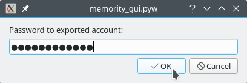

# Как хранить данные с помощью Memority

## Установка приложения и создание аккаунта
1. Зарегистрируйтесь на [https://alpha.memority.io](https://alpha.memority.io)

    

2. Скачайте соответствующую вашей ОС сборку Memority Alpha.

3. Установите приложение, следуя инструкциям установщика\
    (для MacOS при запуске установщика зажмите клавишу Ctrl).

4. Запустите Memority Core.

5. Запустите Memority UI.

6. Перейдите на вкладку "Settings".

    

7. Нажмите "Create account".

    

8. После этого появится диалоговое окно с запросом на создание пароля.\
    Придумайте пароль и введите его здесь.

    

9. В диалоговом окне, которое появится после генерирования адреса, введите ключ, который вы получили после регистрации.

    

10. Подождите несколько минут, пока вам будут начислены токены.\
    После начисления токенов появится диалоговое окно.\
    Выберите, хотите ли вы только хранить свои файлы, или только быть хостером, или и хранить файлы, и быть хостером.
    
    
    
    *Примечание\
    Для того, чтобы быть хостером, необходимо иметь публичный IP-адрес.\
    В противном случае вы будете добавлены в список хостеров, но никто не сможет загрузить свои файлы на ваш компьютер.\
    Для получения публичного IP-адреса обратитесь к своему интернет-провайдеру.

11. Если при создании аккаунта вы выбрали вариант "Be a hoster" или "Both", вы можете изменить объем памяти, выделенный под хостинг.
    
    

12. Готово!

## Загрузка файлов
1. Перейдите на вкладку "My files" и нажмите "Upload file".
    
    

2. Теперь нужно создать депозит для этого файла. В диалоговом окне будет показана стоимость хранения для выбранного файла на период 2 недели. Исходя из этого, укажите количество MMR для депозита.

    

3. Подождите, пока ваш файл будет загружен хостерам.  

    

4. Готово!

## Скачивание файла
1. Перейдите на вкладку "My files". В списке файлов найдите нужный. Нажмите на кнопку "Download".

    

2. В появившемся диалоговом окне выберите папку, в которую нужно скачать файл.

3. Подождите, пока ваш файл будет скачан.

    

4. Готово!

## Экспортирование аккаунта
В приложении Memority есть возможность экспортировать аккаунт в виде зашифрованного файла. Это может быть полезно для того, чтобы установить приложение на другой компьютер и получить доступ к своим файлам, или чтобы сделать бекап - если у вас сломается жесткий диск и данные будут повреждены, вы сможете опять получить доступ к своим файлам, импортировав этот аккаунт.

1. На вкладке "Settings" нажмите "Export account".

    

2. В появившемся диалоговом окне выберите папку, в которую нужно сохранить файл аккаунта.

3. Готово!

## Импортирование аккаунта

1. На вкладке "Settings" нажмите "Import account".

    

2. В появившемся диалоговом окне выберите файл аккаунта, который нужно импортировать.

3. В диалоговом окне введите пароль к импортированному аккаунту.

    

3. Готово!

